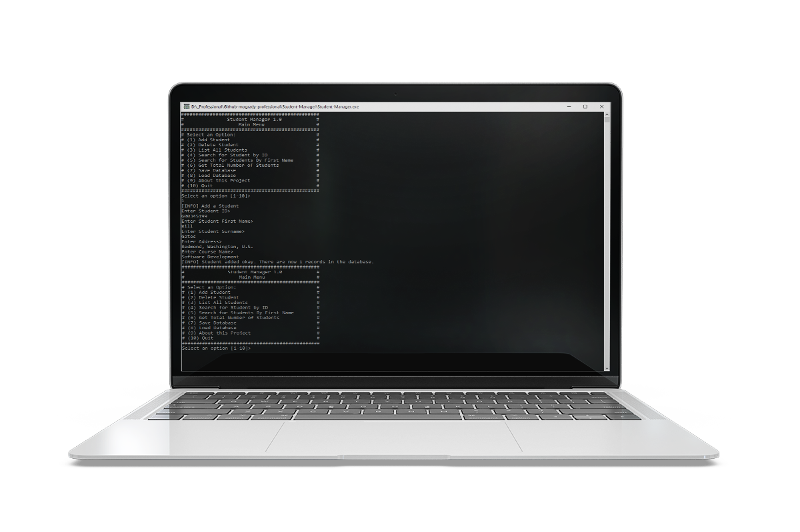
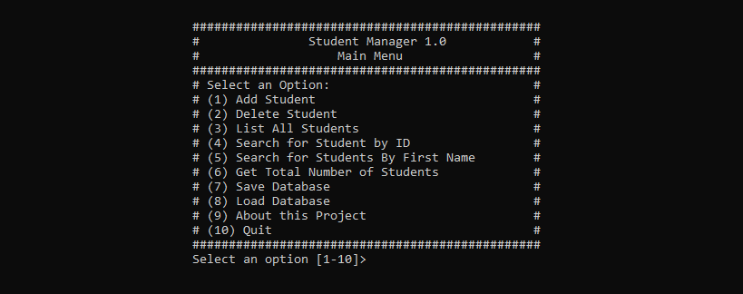

<h1> Student Manager Java Application </h1>

<!-- <p align="center" >
 
</p> -->

## Table of Contents

- [Table of Contents](#table-of-contents)
  - [Description](#description)
  - [System requirements](#system-requirements)
  - [Features](#features)
  - [Running the finished application as an executable](#running-the-finished-application-as-an-executable)
    - [Loading sample data](#loading-sample-data)
- [Compile the application yourself](#compile-the-application-yourself)
  - [Compile Source Code](#compile-source-code)
  - [Build](#build)
    - [System Requirements](#system-requirements-1)
  - [Run](#run)
  - [Run the application from the JAR file](#run-the-application-from-the-jar-file)

---

<p align="center" >
 
</p>

### Description

A simple Java command-line application which manages a database of students. The application has the ability to parse an existing database or create a new database of students. For convenience, the final production application has been compiled into a JAR and an executable .exe file.

### System requirements

- JavaSE-1.8 or higher.

### Features

Users are presented with a menu offering some control over how to programme will function. Options include:

- Add Student
- Delete Student
- List all students
- Search for Student by ID
- Search for Students By First Name
- Get Total Number of Students
- Save Database
- Load Database
- About this Project
- Quit

### Running the finished application as an executable

As the project has already been compiled into an executable file, all you need to do is to:

- download the project and run Student-Manager.exe
- all other files are not required except for the db folder.

#### Loading sample data

The db folder contains four demonstration databases for loading and testing. When prompted to load a database, use the following as an example of loading a database:

```
C:\Users\Michael\Desktop\db\100000-students.db
```

## Compile the application yourself

If you prefer to compile the source code yourself this section is for you.

### Compile Source Code

Run the following command inside the src folder to compile into `.class` files.

```
javac ie/gmit/dip/*.java
```

### Build

#### System Requirements

- JavaSE-1.8 or higher.

Download the project and run the following command from inside the `bin` directory (or the folder with the `.class`) files to create a JAR file.

```
jar -cf Student-Manager.jar ie/gmit/dip/*.class
```

### Run

### Run the application from the JAR file

Navigate to the directory in which the JAR file is located (bin folder) and then run the following:

```
java -cp ./Student-Manager.jar ie.gmit.dip.Runner
```
